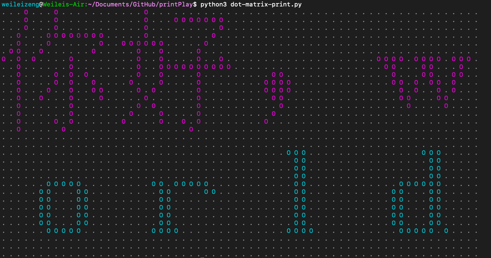

# print chinese and English as dot matrix

require python3

feature:

- [x] change width ( number of characters each line)
- [x] change color ( each line )

reference:

* [utf-8 table](https://www.utf8-chartable.de/)

* [GB2312 table](http://ash.jp/code/cn/gb2312tbl.htm)

* [English alphabet in GB2312](http://blog.chinaaet.com/stillnesstr/p/9912)

# TODO

ideas: Considering the SVG format, all data is saved as paths, lines, circles, polygons, etc. I can use a similar format to save the skeleton image, hence all intersection points can be identified. It is also easier to evenly distribute the dots/drones.

### Acknowledgement

This repoo is modified based on the [original repo](https://github.com/pengfexue2/printPlay). My main update is adding support fot English alphabet and rearrange the code into small blocks
